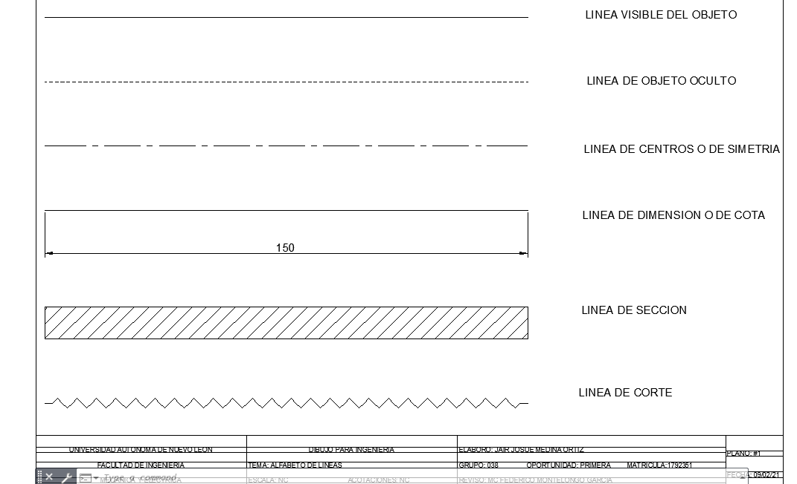
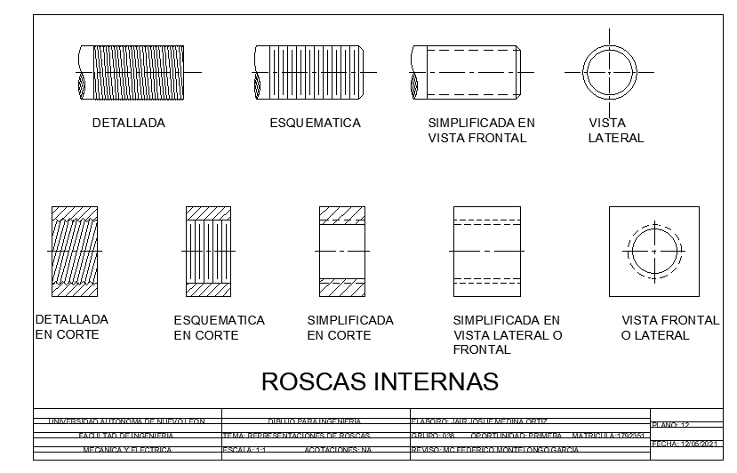
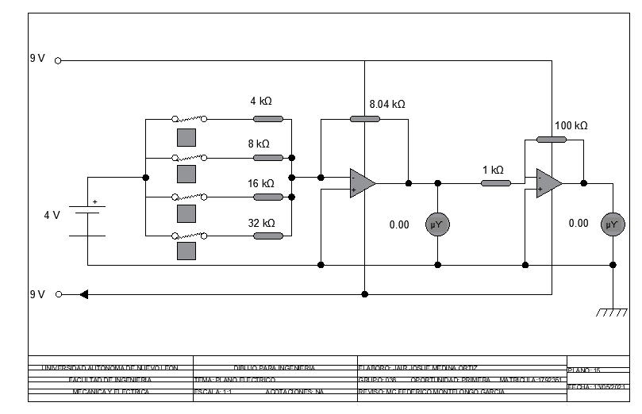

# CAD
## This repository includes dwg files ▼
 Files are part of my CAD course, I've decided to upload them to add to my engineering acumen.

### - In the basic CAD file you will find the first basic approach to CAD drawing in .dwg files.

### - In the Intermediate CAD file there are some mid level sketches and mechanic tools.

### - In the CAD projects file there are some real CAD applications such as a Piping and Instrumentation diagram or an electronic sketch.

